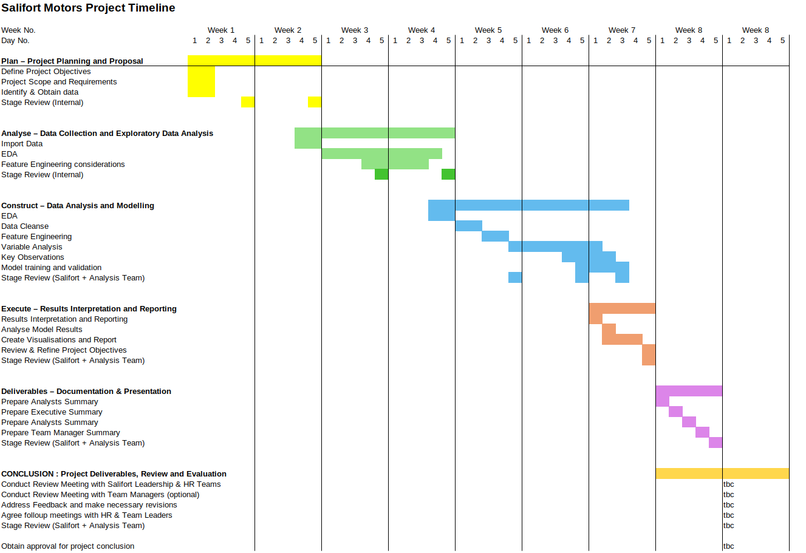

<table style="margin-right:auto;margin-left:0px">
<tr>
<td></td>
<td><a href="/projects/1/01/01/salifort_project/">Back</a></td>
<td><a href="/notebooks/Activity_00_Salifort_Motors_project-PROPOSAL.html">Client Proposal</a</td>
<td><a href="/notebooks/Activity_9c_Salifort_Motors_Analyst_SUMMARY.md).html">EDA Analysis</a></td>
<td><a href="/notebooks/Activity_3c_Salifort_Motors_project_Feature-Engineering.html">Feature Engineering</a></td>
<td><a href="/notebooks/Activity_4a_Salifort_Motors_project_Logistical_Regression_Model.html">ML Models - Logistical Regression</a></td>
<td><a href="/notebooks/Activity_4b_Salifort_Motors_project_Decision_Tree_Model.html">ML Models - Decision Tree</a></td>
<td><a href="/notebooks/Activity_4c_Salifort_Motors_project_Random_Forest_Model.html">ML Models - Random Forest</a></td>
<td><a href="/notebooks/Activity_9z_Salifort_Motors_project_MODEL-DEMONSTRATION.html">Model Demonstration</a></td>
</tr>
</table>

[test]({{.Site.BaseURL }}/notebooks/Activity_00_Salifort_Motors_project-PROPOSAL.md)

# Capstone project: Providing data-driven suggestions for HR

Client Proposal Document
Client Proposal Presentation

## PLANNING

### Timeline

### Planning Tasks

Identify Stakeholders and build Communications Matrix, Stakeholder Analysis

#### Stakeholder Meetings

- Discuss limitations of machine learning with stakeholders
- Discuss and agree project objectives with stakeholders
- Discuss and agree project deliverables with stakeholders
- Discuss and agree project timescales with stakeholders
- Discuss and agree "What does success look like" with stakeholders

### Data Tasks

Collect & Review Data Sources
Identify tools and models (multi model approach to identify best fit)

## Analyse Data

### Analyse - Tasks

- Ethics Review (transparency, accountability, fairness, privacy, security, consent, and integrity.)
- Perform Exploratory Data Analysis
- Develop descriptive variable statistics & identify any trends

### Analyse - Deliverables

Jupyter Notebooks

## Construct

### Construct Tasks

- Define dependant and independent variables
- Build ML Models for logistical Regression, Decision Tree, Random Forest
- Record model performance
- Evaluate model performance choose best performing model

### Deliverables

- Demonstration ML Model
- Model Risk Predictions on Live HR Data

## Execute

### Execute - Tasks

Interpret Results
Create Summary of the analysis
Define limitations and what can be done to improve the models (more data)

### Execute - Deliverables

#### Executive Summary

- Executive Summary
- Recommendations

#### HR Summary

- Report by team on current employees
- Leave Predictions on current employees
- Interactive Demonstration ML Model
  
#### Analyst's Summary

- Clear and Concise summary of the analysis
  - Outcomes
  - S.M.A.R.T Proposals
  - Further Research ideas

- Working ML Model to apply to current employee Data
- Team Summaries (if different)
