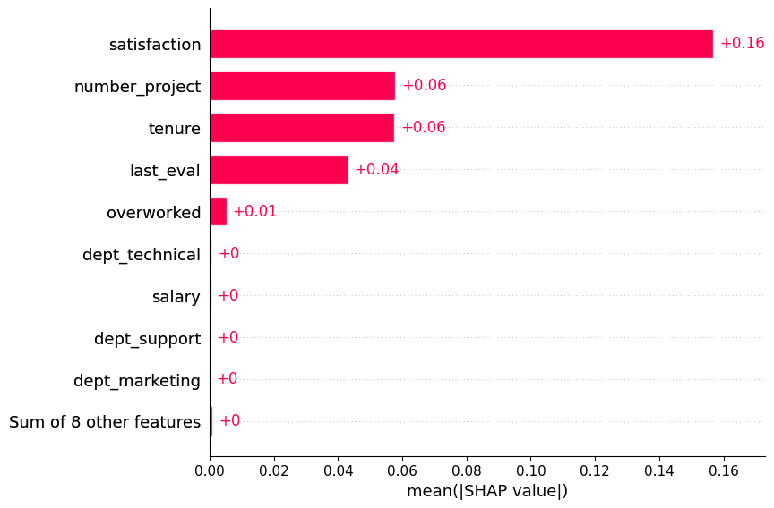
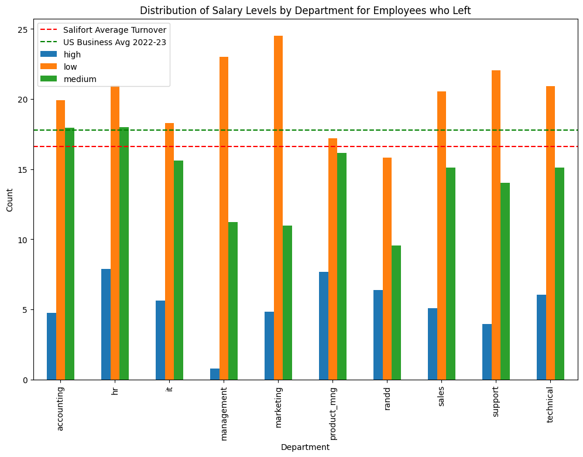

# Salifort Motors Executive Summary

## Project Overview

Data provided by the Salifort team was analysed to determine key factors in employees leaving the company. A machine learning model was built and used to model current employees and identify the key reasons for employees leaving.

Exploratory Data Analysis was carried out on the provided data and key features of employees who left (the predictor) were identified during the ML modelling phase.

- Employees who report a low or medium satisfaction score are most likely to leave
- Employees working more than 175 hrs a month are most likely to leave
- Employees working on too many or two few project are most likely to leave
- Sales, Support and Technical make up 61% of all employees and have the highest employee turnover
- Employees on low or medium salaries are most likely to leave

## Executive Summary

- Support Employee Advancement
- Offer Competitive compensation
- Cultivate a culture of care
- Offer flexible working

## Overview

In the year 2020, industries across the board experienced a significant surge in turnover rates. This trend was largely attributed to the challenges posed by the pandemic, leading many companies to adapt to closures, downsizing, or the shift to remote work.

## Why Address This Issue?

Despite the gradual return to normalcy, employees continue to depart for new opportunities at an unprecedented rate. Employee turnover exacts a considerable cost, with the hiring process alone accounting for at least half of the departing employee's annual salary. Moreover, as more individuals leave, the company culture may suffer, placing additional stress on remaining staff.

While some turnover is inevitable, aiming for a 10% turnover rate is prudent. According to the Society for Human Resource Management (SHRM), most companies currently hover around a 20% turnover rate. The ideal rate depends on various factors, including industry and internal promotion rates.

## Strategies to Enhance Retention Rates

It is imperative to acknowledge that employees are individuals, not mere figures or resources. Creating a culture that fosters a sense of value, career development, visibility, and care is crucial to encouraging employee retention.

To cultivate such a culture, consider implementing the following tips into your retention strategy:

In order to create said culture, take a look at some specific tips you can incorporate into your retention strategy:

### Support Employee Advancement

Investing in professional development and career growth opportunities is essential, as 88% of individuals consider these opportunities crucial when evaluating potential employers. This commitment not only cultivates skilled and confident employees but also demonstrates a genuine concern for their ongoing improvement and success.

### Offer Competitive Compensation

Competitive and fair salaries for every position within the company are pivotal to any retention strategy. Ensure that leaders seriously consider requests for raises. Additionally, creative benefits such as health insurance, vision and dental coverage, and unique perks like free snacks or wellness programs can significantly contribute to employee satisfaction.

### Cultivate a Culture of Care

Employees need to perceive that the company genuinely cares for them. Offering flexibility in work arrangements, such as unlimited PTO, flexible hours, or remote work options, can cater to the diverse needs of your workforce. Implementing recognition programs, such as service awards and wellness initiatives, reinforces a culture of appreciation and significantly reduces turnover.

## Enhancing Retention in Your Organization

In a landscape where employees have abundant employment options, investing time, effort, and resources in making them feel valued as integral team members is crucial. By supporting career development, enhancing compensation, and fostering a positive culture, your company can demonstrate loyalty to its employees, fostering reciprocal loyalty to the organization.
